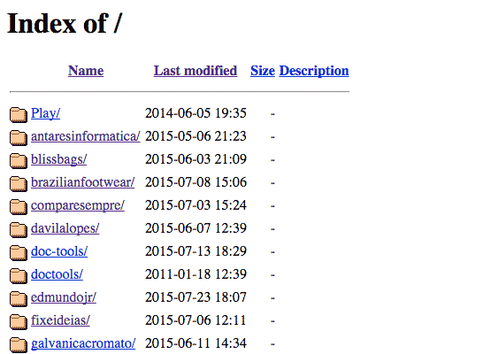
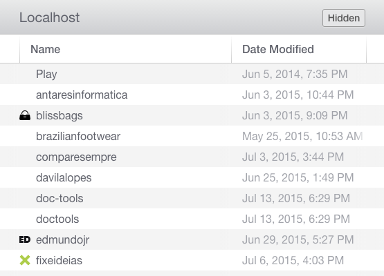

# Pretty Localhost is Pretty

I don't like the default styling of localhost (directory contents), so I redesign it.

## Before

## After

## Installing

1. Download the repository and move the .dot files to your localhost directory – on OS X, that will be the `Sites` folder.
2. Done!

To toggle visibility of .dot's files, do this on Terminal:

    defaults write com.apple.finder AppleShowAllFiles -bool TRUE && killall Finder

To get back to the default behavior, just change `TRUE` to `FALSE`.

## Features

- **Such pixels!**
- Responsive
- Sort by name or modification date
- Show/hide hidden files
- Favicon's

## Collaborating

If you have any suggestions, please create an [issue](issues/new) or fork the project and submit your pull request.

## Acknowledge

Code heavily taken from [this post](https://css-tricks.com/snippets/php/display-styled-directory-contents/) on CSS-Tricks. So hats off to [Chris Coyier](https://twitter.com/chriscoyier)!